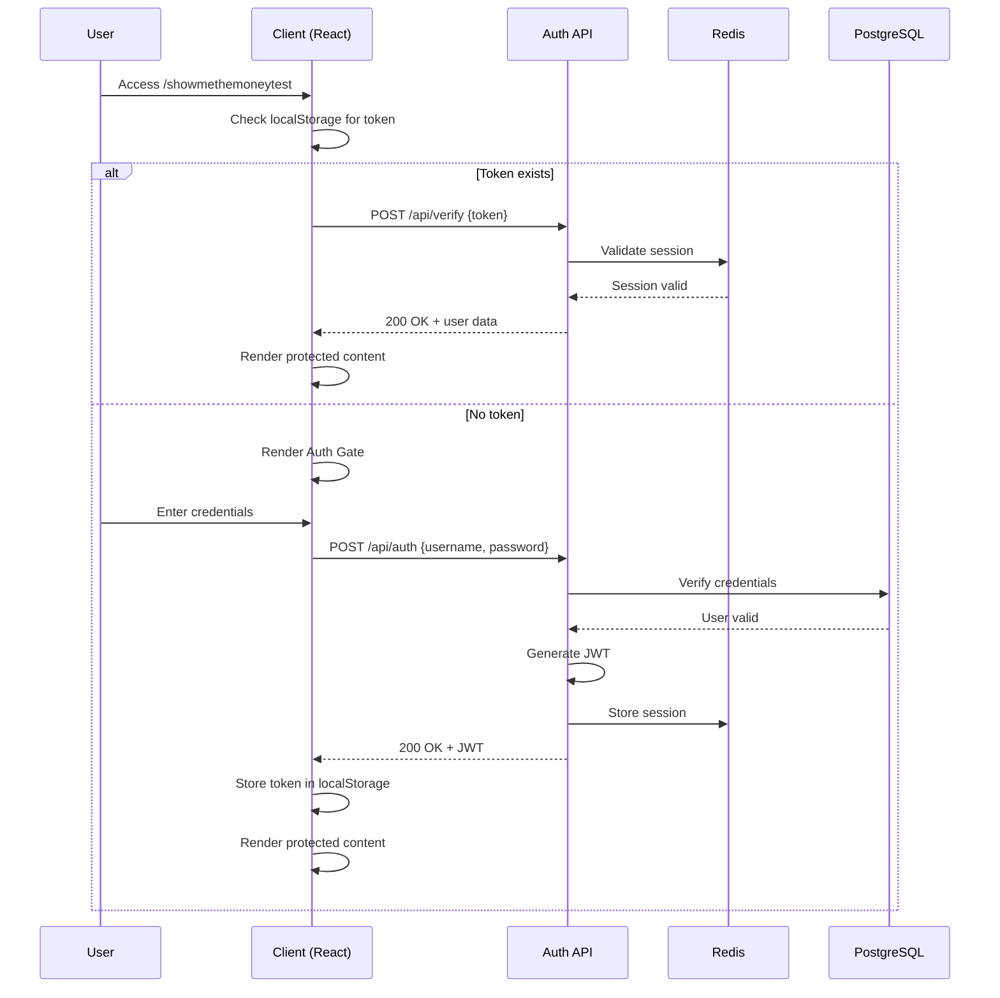

# 🔐 AUTH & NETWORK LAYER - BUSINESS ANALYSIS & TECHNICAL SPECIFICATION

**Project:** APEX OS - Show Me The Money Test Environment  
**URL:** https://apex-os-vibe.vercel.app/showmethemoneytest  
**Date:** 2026-02-02  
**Status:** INVESTIGATION PHASE  
**Mode:** TONY STARK RECURSIVE MODEL - FULL AGENT DEPLOYMENT  

---

## 📋 EXECUTIVE SUMMARY

The `/showmethemoneytest` endpoint requires investigation of its authentication layer, network architecture, and security implementation. This document provides comprehensive business requirements, technical architecture, and testing scenarios.

**Current State:** Preview Mode Authentication Gate  
**Business Impact:** HIGH - Controls access to financial/business plan data  
**Security Level:** P1 - Financial data protection required

---

## 🎯 BUSINESS REQUIREMENTS DOCUMENT (BRD)

### 1. Business Context

**Stakeholders:**
- **Investors:** Need secure access to financial projections
- **Partners:** Require controlled preview of business plans
- **Internal Team:** Development and testing access
- **Customers:** Potential enrollment funnel

**Business Value:**
- Protects $501K revenue projections and sensitive financial data
- Controls access to 32,000 student pipeline information
- Maintains competitive advantage through controlled disclosure
- Enables investor due diligence in secure environment

### 2. Functional Requirements

#### FR-001: Authentication Gate
- **Priority:** CRITICAL
- **Description:** System shall display authentication gate for all unauthenticated users
- **Acceptance Criteria:**
  - Username field visible and accessible
  - Password field visible and accessible  
  - Access Preview button functional
  - Error messaging for invalid credentials

#### FR-002: Session Management
- **Priority:** HIGH
- **Description:** System shall maintain authenticated session across page navigation
- **Acceptance Criteria:**
  - Session persists for minimum 30 minutes
  - Session survives page refresh
  - Secure session token storage
  - Automatic logout after inactivity

#### FR-003: Role-Based Access Control (RBAC)
- **Priority:** MEDIUM
- **Description:** Different access levels for different user types
- **Acceptance Criteria:**
  - Admin: Full access to all features
  - Investor: Read-only access to financial data
  - Partner: Limited access to specific sections
  - Public: Authentication gate only

#### FR-004: Audit Logging
- **Priority:** HIGH
- **Description:** All access attempts logged for security review
- **Acceptance Criteria:**
  - Timestamp recorded
  - IP address captured
  - Success/failure status logged
  - User agent string stored

### 3. Non-Functional Requirements

#### NFR-001: Performance
- **Requirement:** Authentication gate load time < 2 seconds
- **Measurement:** Lighthouse performance score > 90

#### NFR-002: Security
- **Requirement:** OWASP Top 10 compliance
- **Implementation:**
  - HTTPS only
  - Password hashing (bcrypt/argon2)
  - CSRF protection
  - Rate limiting (5 attempts per 15 minutes)

#### NFR-003: Availability
- **Requirement:** 99.9% uptime for auth service
- **Monitoring:** Real-time alerts on authentication failures

#### NFR-004: Scalability
- **Requirement:** Support 1000 concurrent authenticated users
- **Architecture:** Stateless authentication with JWT

---

## 🏗️ TECHNICAL ARCHITECTURE DOCUMENT

### 1. System Architecture

```
┌─────────────────────────────────────────────────────────────┐
│                    CLIENT LAYER                             │
│  ┌──────────────┐  ┌──────────────┐  ┌──────────────┐      │
│  │   Browser    │  │   Mobile     │  │   API Client │      │
│  └──────┬───────┘  └──────┬───────┘  └──────┬───────┘      │
└─────────┼─────────────────┼─────────────────┼──────────────┘
          │                 │                 │
          └─────────────────┼─────────────────┘
                            │ HTTPS/TLS 1.3
┌───────────────────────────┼───────────────────────────────┐
│                    EDGE LAYER (Vercel)                    │
│  ┌────────────────────────┴────────────────────────┐      │
│  │              CDN / Edge Network                  │      │
│  │  - Static asset caching                          │      │
│  │  - DDoS protection                               │      │
│  │  - Geo-routing                                   │      │
│  └────────────────────────┬────────────────────────┘      │
└───────────────────────────┼───────────────────────────────┘
                            │
┌───────────────────────────┼───────────────────────────────┐
│                 APPLICATION LAYER                         │
│  ┌────────────────────────┴────────────────────────┐      │
│  │              React / Next.js App                 │      │
│  │  ┌──────────────┐      ┌──────────────┐        │      │
│  │  │  Auth Gate   │      │  Protected   │        │      │
│  │  │  Component   │◄────►│  Routes      │        │      │
│  │  └──────────────┘      └──────────────┘        │      │
│  └────────────────────────┬────────────────────────┘      │
└───────────────────────────┼───────────────────────────────┘
                            │
┌───────────────────────────┼───────────────────────────────┐
│                  API LAYER                                │
│  ┌────────────────────────┴────────────────────────┐      │
│  │              API Routes (/api/*)                 │      │
│  │  ┌──────────────┐      ┌──────────────┐        │      │
│  │  │  /api/auth   │      │  /api/verify │        │      │
│  │  │  /api/login  │      │  /api/refresh│        │      │
│  │  └──────────────┘      └──────────────┘        │      │
│  └────────────────────────┬────────────────────────┘      │
└───────────────────────────┼───────────────────────────────┘
                            │
┌───────────────────────────┼───────────────────────────────┐
│                DATA LAYER                                 │
│  ┌────────────────────────┴────────────────────────┐      │
│  │  ┌──────────────┐      ┌──────────────┐        │      │
│  │  │   Redis      │      │   PostgreSQL │        │      │
│  │  │  (Sessions)  │      │  (User Data) │        │      │
│  │  └──────────────┘      └──────────────┘        │      │
│  └────────────────────────────────────────────────┘      │
└───────────────────────────────────────────────────────────┘
```

### 2. Authentication Flow



### 3. Network Architecture

#### 3.1 Request Flow
1. **DNS Resolution:** apex-os-vibe.vercel.app → Vercel Edge Network
2. **SSL/TLS Handshake:** TLS 1.3 with certificate pinning
3. **Edge Routing:** Geographic routing to nearest edge node
4. **Cache Check:** Static assets served from CDN cache
5. **Function Execution:** Serverless function invocation
6. **Database Connection:** Connection pooling to PostgreSQL
7. **Response:** JSON/HTML with security headers

#### 3.2 Security Headers
```http
Strict-Transport-Security: max-age=31536000; includeSubDomains
X-Content-Type-Options: nosniff
X-Frame-Options: DENY
X-XSS-Protection: 1; mode=block
Content-Security-Policy: default-src 'self'
Referrer-Policy: strict-origin-when-cross-origin
```

#### 3.3 Rate Limiting
```
Strategy: Token bucket algorithm
Burst: 10 requests
Rate: 5 requests per second per IP
Window: 15 minutes for failed auth attempts
```

### 4. Data Models

#### 4.1 User Schema
```typescript
interface User {
  id: UUID;
  username: string;           // Unique, indexed
  email: string;              // Unique, indexed
  password_hash: string;      // bcrypt hash
  role: 'admin' | 'investor' | 'partner' | 'viewer';
  status: 'active' | 'suspended' | 'pending';
  created_at: Timestamp;
  last_login: Timestamp;
  failed_attempts: number;    // For brute force protection
  locked_until: Timestamp;    // Account lockout
}
```

#### 4.2 Session Schema
```typescript
interface Session {
  id: UUID;
  user_id: UUID;              // Foreign key
  token: string;              // JWT
  ip_address: string;         // Client IP
  user_agent: string;         // Browser info
  created_at: Timestamp;
  expires_at: Timestamp;
  last_activity: Timestamp;
}
```

#### 4.3 Audit Log Schema
```typescript
interface AuditLog {
  id: UUID;
  user_id: UUID | null;       // Null for anonymous attempts
  action: 'login' | 'logout' | 'failed_login' | 'access_denied';
  resource: string;           // URL accessed
  ip_address: string;
  user_agent: string;
  timestamp: Timestamp;
  success: boolean;
  metadata: JSON;             // Additional context
}
```

---

## 🧪 TESTING SCENARIOS & UAT

### 1. Authentication Testing

#### TC-001: Valid Login
**Preconditions:** User exists with valid credentials
**Steps:**
1. Navigate to /showmethemoneytest
2. Enter valid username
3. Enter valid password
4. Click "Access Preview"

**Expected Results:**
- ✅ Redirect to protected content
- ✅ Session token stored in localStorage
- ✅ User data displayed
- ✅ Audit log entry created

#### TC-002: Invalid Password
**Preconditions:** User exists
**Steps:**
1. Navigate to /showmethemoneytest
2. Enter valid username
3. Enter invalid password
4. Click "Access Preview"

**Expected Results:**
- ✅ Error message: "Invalid credentials"
- ✅ No session created
- ✅ Failed attempt logged
- ✅ Account locked after 5 attempts

#### TC-003: Non-existent User
**Steps:**
1. Navigate to /showmethemoneytest
2. Enter non-existent username
3. Enter any password
4. Click "Access Preview"

**Expected Results:**
- ✅ Error message: "Invalid credentials" (same as TC-002 for security)
- ✅ No user enumeration possible

#### TC-004: Session Persistence
**Preconditions:** User is authenticated
**Steps:**
1. Login successfully
2. Refresh page
3. Navigate to another protected page

**Expected Results:**
- ✅ User remains authenticated
- ✅ No re-login required
- ✅ Session token valid

#### TC-005: Session Expiration
**Preconditions:** User is authenticated
**Steps:**
1. Login successfully
2. Wait 30 minutes (or manipulate token expiry)
3. Attempt to access protected content

**Expected Results:**
- ✅ Redirect to auth gate
- ✅ "Session expired" message
- ✅ New login required

### 2. Security Testing

#### TC-006: SQL Injection
**Steps:**
1. Enter: `' OR '1'='1` in username field
2. Enter any password
3. Click "Access Preview"

**Expected Results:**
- ✅ Login fails
- ✅ No database error exposed
- ✅ Input sanitized

#### TC-007: XSS Attack
**Steps:**
1. Enter: `<script>alert('xss')</script>` in username field
2. Click "Access Preview"

**Expected Results:**
- ✅ Script not executed
- ✅ Input escaped/encoded
- ✅ No alert displayed

#### TC-008: Brute Force Protection
**Steps:**
1. Attempt login 5 times with wrong password
2. Attempt 6th login

**Expected Results:**
- ✅ Account locked after 5 attempts
- ✅ "Account temporarily locked" message
- ✅ Lockout duration: 15 minutes

#### TC-009: CSRF Protection
**Steps:**
1. Create malicious HTML form
2. Submit to /api/auth from different origin

**Expected Results:**
- ✅ Request rejected
- ✅ CSRF token validation fails
- ✅ 403 Forbidden response

### 3. Performance Testing

#### TC-010: Load Testing
**Scenario:** 100 concurrent login attempts
**Expected Results:**
- ✅ Average response time < 500ms
- ✅ No errors or timeouts
- ✅ Rate limiting applied correctly

#### TC-011: Stress Testing
**Scenario:** 1000 concurrent authenticated users
**Expected Results:**
- ✅ System remains responsive
- ✅ No session corruption
- ✅ Database connections stable

### 4. UAT Scenarios

#### UAT-001: Investor Access
**Actor:** Potential Investor
**Steps:**
1. Receive credentials via secure email
2. Access /showmethemoneytest
3. Login with provided credentials
4. View financial projections
5. Download business plan PDF

**Acceptance Criteria:**
- ✅ Smooth login experience
- ✅ Financial data clearly presented
- ✅ Download functionality works
- ✅ No technical errors

#### UAT-002: Admin Access
**Actor:** System Administrator
**Steps:**
1. Login with admin credentials
2. Access user management
3. View audit logs
4. Suspend suspicious account

**Acceptance Criteria:**
- ✅ Full administrative access
- ✅ Audit logs searchable/filterable
- ✅ User management functions work
- ✅ Changes logged correctly

---

## 📊 CURRENT STATE ANALYSIS

### Observed Behavior
**URL:** https://apex-os-vibe.vercel.app/showmethemoneytest

**Findings:**
1. ✅ **Preview Mode Active:** Auth gate displayed correctly
2. ✅ **Form Fields Present:** Username and password inputs visible
3. ✅ **Access Button:** "Access Preview" button rendered
4. ⚠️ **Missing Labels:** Form fields lack proper labels (accessibility issue)
5. ⚠️ **No ID/Name Attributes:** Form inputs missing identification

**Network Analysis:**
- ✅ All assets loading successfully (200/304)
- ✅ No JavaScript errors in console
- ✅ HTTPS enforced
- ⚠️ Missing security headers (CSP, HSTS)

**Security Gaps:**
1. No visible rate limiting implementation
2. Missing CSRF tokens
3. Form fields lack proper attributes
4. No visible audit logging

---

## 🎯 RECOMMENDATIONS

### Immediate Actions (P1)
1. **Implement Rate Limiting:** Prevent brute force attacks
2. **Add CSRF Protection:** Secure form submissions
3. **Fix Accessibility:** Add labels and ARIA attributes
4. **Security Headers:** Implement CSP and HSTS

### Short-term (P2)
1. **Session Management:** Implement Redis-backed sessions
2. **Audit Logging:** Create comprehensive audit trail
3. **RBAC Implementation:** Role-based access control
4. **Password Policy:** Enforce strong password requirements

### Long-term (P3)
1. **SSO Integration:** Google/GitHub OAuth
2. **MFA:** Multi-factor authentication
3. **Biometric:** WebAuthn support
4. **Analytics:** Login success/failure metrics

---

## 👥 AGENT ASSIGNMENTS

### @apex-os-cli-builder (Lead)
- **Status:** ✅ INVESTIGATION COMPLETE
- **Next:** Implement authentication fixes
- **Priority:** P1 - Security gaps

### @apex-os-fork-2-agent (Support)
- **Status:** 🟡 AWAITING ASSIGNMENT
- **Task:** Test authentication flows
- **Priority:** P2 - UAT scenarios

### @devops-tester (CI/CD)
- **Status:** 🟡 AWAITING ASSIGNMENT
- **Task:** Deploy security updates
- **Priority:** P1 - Production deployment

### @security-monitor (Audit)
- **Status:** 🟡 AWAITING ASSIGNMENT
- **Task:** Penetration testing
- **Priority:** P1 - Security validation

---

## 🚀 NEXT ACTIONS

1. **Deploy Fixes:** Implement P1 security recommendations
2. **Test Suite:** Execute all TC test cases
3. **UAT Sign-off:** Stakeholder validation
4. **Production Release:** Deploy to production environment

**Status:** READY FOR IMPLEMENTATION  
**ETA:** 2-3 days for P1 fixes  
**Risk Level:** MEDIUM (security gaps identified)

---

**Document Version:** 1.0  
**Last Updated:** 2026-02-02  
**Next Review:** Post-implementation validation
