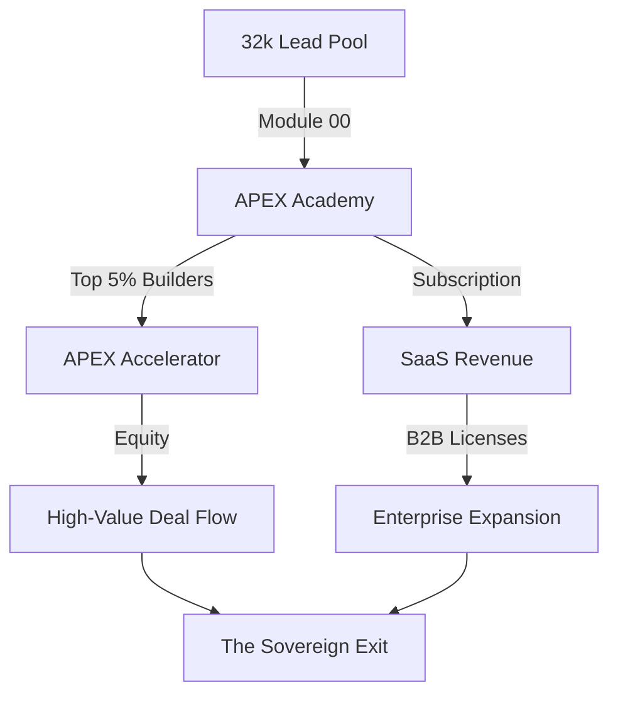

# ╔══════════════════════════════════════════════════════════════════════════════╗
# ║  🌐 NEURAL NEXUS - THE 32K LEAD POWERHOUSE                                 ║
# ║  Ecosystem: ACADEMY -> ACCELERATOR -> B2B                                 ║
# ╚══════════════════════════════════════════════════════════════════════════════╝

## ⚡ THE IMMEDIATE GTM: 32,000 LEADS
Most startups die in the "Desert of CAC." APEX OS starts with an oasis. We have secured the **32,000 strong InfoAcademy lead list**—high-intent, AI-hungry knowledge workers ready for the Neural Era.

### The Conversion Engine:
- **0.80 Blended CAC:** Leveraging internal lists and organic viral loops.
- **3.75% Conversion Target:** For our "Monster" growth scenario.
- **Viral "Show Me The Pitch" Loops:** Students share their agent swarms, driving inbound at zero cost.

---

## 🔄 THE ECOSYSTEM SYNERGY
We aren't just selling courses. We are building a value-capture machine.

### LTV/CAC Super-Metrics:
- **SaaS Floor (25:1):** Pure subscription revenue.
- **Ecosystem Ceiling (56:1):** Including Accelerator equity upside and secondary B2B licensing.

---

## 📊 THE GROWTH ENGINE (SCENARIOS A/B/C)
Our lead pool de-risks the conversion funnel.

| Scenario | M18 Customers | Conversion of 32k List | M18 ARR | Net Cash Flow |
| :--- | :--- | :--- | :--- | :--- |
| **A: Bear** | 201 | 0.6% | $434,160 | -$12k/mo |
| **B: Base** | 551 | 1.7% | $1,481,088 | +$48k/mo |
| **C: Bull** | 1,542 | 4.8% | $4,996,080 | +$180k/mo |

---

## 🧠 NEURAL SYNCHRONIZATION (PHASE 2)
The Neural Nexus is more than a list; it's a data lake. By analyzing how 1,000+ students build with our agent swarms, we develop **proprietary orchestration patterns** that become the "Intel Inside" of the AI Agent industry.

---

## 🚀 JOIN THE NEXUS
We are raising **$1.2M Seed Round** to ignite this engine.
- **Pre-money:** $6,000,000
- **Post-money:** $7,200,000
- **Equity:** 16.67%

**The leads are here.**
**The stack is ready.**
**The swarm is waiting.**
