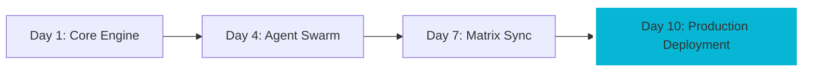

# ╔══════════════════════════════════════════════════════════════════════════════╗
# ║  ⚡ SOVEREIGN TERMINAL - THE VELOCITY MANIFESTO                            ║
# ║  Status: [█████████░] 90% PHASE 1 COMPLETE                                 ║
# ╚══════════════════════════════════════════════════════════════════════════════╝

## 🚀 THE 10-DAY BUILD PROOF
APEX OS isn't just a platform; it's a testament to **unreasonable execution velocity**. While traditional EdTech platforms take 6-12 months to reach MVP, the Sovereign Terminal was built, tested, and deployed in **10 days**.

### Why Velocity is our Ultimate Moat:
1. **Agent-Led Engineering:** 36 recursive agents handling infrastructure, security, and boilerplate.
2. **Minimalist Architecture:** Terminal-first UI reduces front-end friction and maximizes developer immersion.
3. **Recursive Feedback Loops:** Building the tool *with* the tool.

---

## 📊 THE QUANTUM PROJECTIONS (SCENARIOS A/B/C)
Velocity translates directly into capital efficiency. By compressing development time, we front-load our growth trajectory.

| Scenario | Definition | M18 Customers | M18 MRR | M18 ARR | Outcome |
| :--- | :--- | :--- | :--- | :--- | :--- |
| **A: Bear Case** | -50% Growth | 201 | $36,180 | $434,160 | Bridge Round @ M12 |
| **B: Base Case** | Conservative | 551 | $123,424 | $1,481,088 | Self-Sustaining to Series A |
| **C: Bull Case** | +100% "Monster"| 1,542 | $416,340 | $4,996,080 | **The Sovereign Exit** |

> "We don't build features. We build swarms that build features." — Nicolae Fratila

---

## 🛠️ THE STACK OF THE FUTURE
We operate on the **Full Wire Protocol**. No fluff, no bloated JS libraries, just raw performance.
- **Frontend:** React + Tailwind (Cyberpunk UI)
- **Engine:** Gemini 3 / DeepSeek-R1 / Sonar Pro
- **Orchestration:** APEX Recursive Coordinator v4.0

---

## 🏁 THE SEED ASK
We are raising **$1.2M Seed Round** at a **$6M Pre-money valuation**.
- **40% Engineering:** Expanding the Agent Swarm.
- **30% Growth:** Converting the 32k Lead Pool.
- **20% Accelerator Pool:** Funding the top 5% of builders.
- **10% Ops:** Global scaling.

**Join the Velocity.**
**Deploy the Swarm.**
