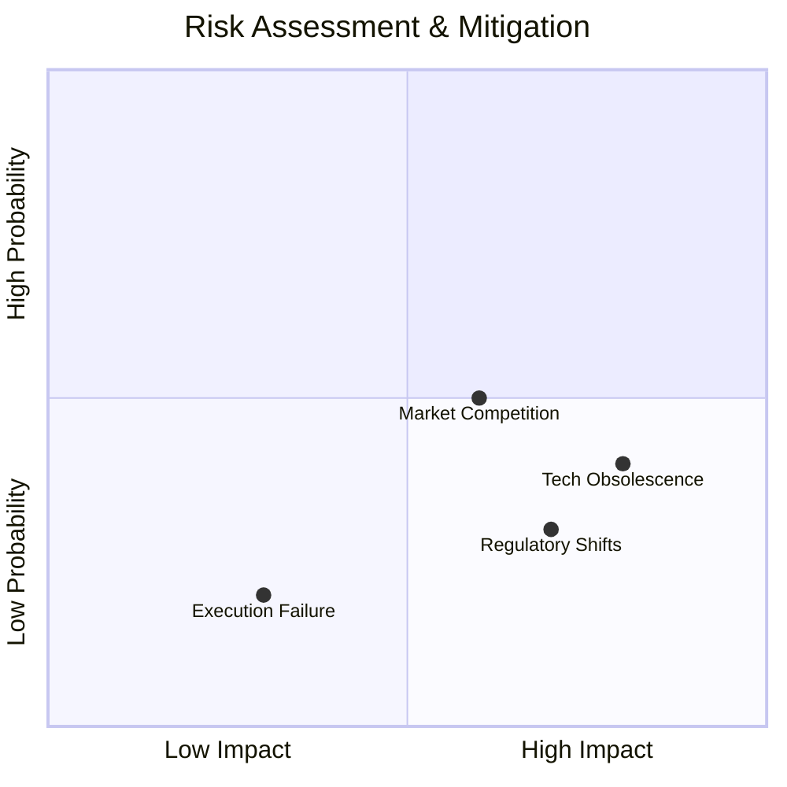

# ╔══════════════════════════════════════════════════════════════════════════════╗
# ║  🧠 UNREASONABLE STRATEGIST - RISK & GLOBAL SCALE                          ║
# ║  Advisor: KEVIN OBEEGADOO | Jurisdiction: MAURITIUS IFC                    ║
# ╚══════════════════════════════════════════════════════════════════════════════╝

## 🏛️ STRATEGIC ANCHOR: KEVIN OBEEGADOO
APEX OS is balanced by the strategic weight of **Kevin Obeegadoo**. With a focus on legal structure, global fundraising, and risk mitigation, Kevin ensures the "Sovereign Build" scales without systemic failure.

### The Strategic Pillars:
1. **Mauritius IFC Gateway:** Leveraging Mauritius as the primary International Financial Centre for tax efficiency and strategic entry into African and Asian markets.
2. **Legal Fortification:** Ensuring all agent-led transactions and IP ownership are legally robust across jurisdictions.
3. **Risk Matrix Linking:** Dynamic monitoring of execution risks vs. market volatility.

---

## 🛡️ RISK MITIGATION PROTOCOL
We don't avoid risk; we price it and automate its mitigation.

**Mitigation Strategy:** 
- **Principles > Tools:** We teach the logic of orchestration, making the platform immune to specific AI model obsolescence.
- **Community Moat:** 32,000 high-intent leads create a network effect that competitors cannot "buy" with ad spend.

---

## 📈 THE VALUATION MATH (SCENARIOS A/B/C)
Kevin's strategy is backed by the **VC Method Reverse-Engineering**.

| Scenario | M18 ARR | Valuation Multiple | Year 5 Exit Est. | Investor MOIC |
| :--- | :--- | :--- | :--- | :--- |
| **A: Bear** | $434k | 8x | $25M | 4.2x |
| **B: Base** | $1.48M | 10x | $150M | 20.8x |
| **C: Bull** | $4.99M | 12x | $500M+ | 60x+ |

---

## 🌍 GLOBAL FOOTPRINT
By HQ-ing via the **Mauritius IFC**, APEX OS captures:
- **0% Capital Gains Tax**
- **Strategic DTAs** (Double Taxation Agreements) with 40+ countries.
- **A Political Oasis:** The most stable democracy and business environment in the African region.

---

## 💎 THE BOTTOM LINE
The combination of Nicolae's **technical velocity** and Kevin's **strategic de-risking** makes APEX OS the most asymmetric bet in EdTech today.

**Raising $1.2M @ $6M Pre.** 
**The target is $1B or nothing.**
